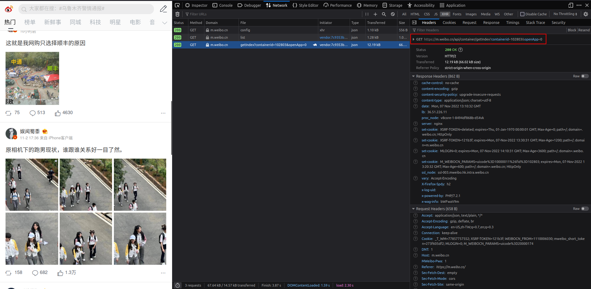
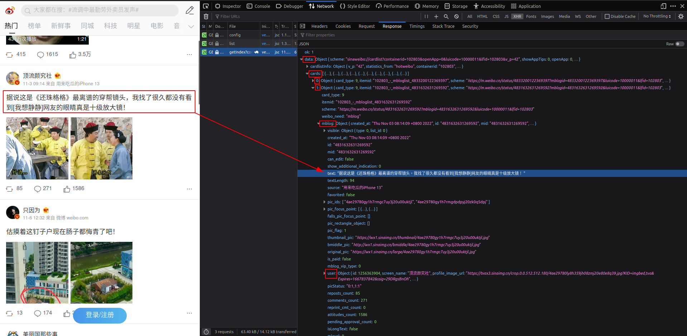

# Weibo trending posts scraper

Scrap trending posts from Weibo front page.

## Weibo API

To understand how Weibo fetches new posts, a network inspection is performed on the mobile website.

A request to endpoint `https://m.weibo.cn/api/container/getIndex?containerid=102803&openApp=0` is observed.



Its response looks like this:



The response is a nested JSON object. We're interested in the items in `data`'s `cards` array.

Each *card* contains a `mblog` (microblog) object that encapsulates the content as well as metadata about the content.

One call to the API returns ten cards. Whenever the device viewport scrolls toward the bottom of the page, the API is called again to fetch 10 more posts.

This simple utility extracts the following fields from `mblog`:
- `id`: post ID (str)
- `created_at`: post date (str)
- `text`: post text; can contain HTML tags when a video stream is included
- `source`: device the post is submitted from
- `url`: link to the post
- `user`: the poster
- `pics`: the URLs to the images included in this post (array of objects)

In addition, the following `user` fields are also extracted:
- `id`: user ID (int)
- `screen_name`: screen name
- `profile_url`: link to user profile
- `gender`: `"f"` for female, `"m"` for male. Weibo does not provide codes for those who are non-binary
- `followers_count`: the str number of followers in units of 10,000. For example: `"433.8万"` (4,338,000).

Note that repeated calls sometimes return posts that have been returned before.

## Usage guide

### As a library

- pip install weibo_trending
- from weibo_trending import get_new_posts, parse_posts


### As a command line tool

- pip install weibo_trending
- python -m weibo_trending


## Develop

```
git clone https://github.com/ericlingit/weibo-trending.git
cd weibo-trending
python3 -m venv venv
source venv/bin/activate
pip install -U pip wheel
pip install -r requirements.txt
pip install -e .
pytest
```

### Packaging

```
python -m build --wheel
```

The built wheel is in `./dist/`.
